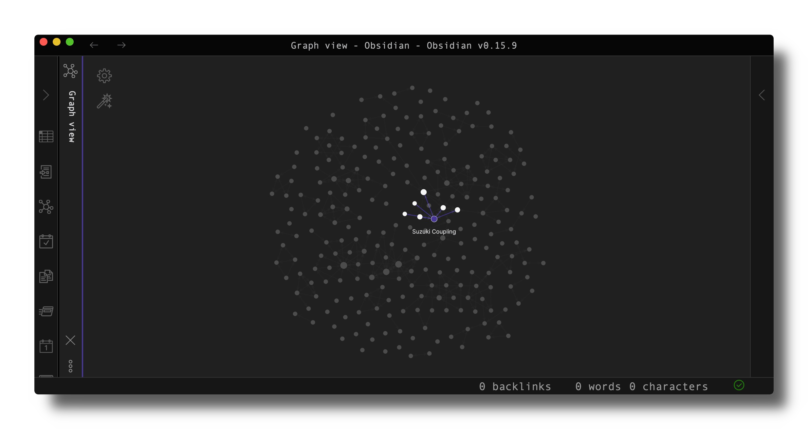
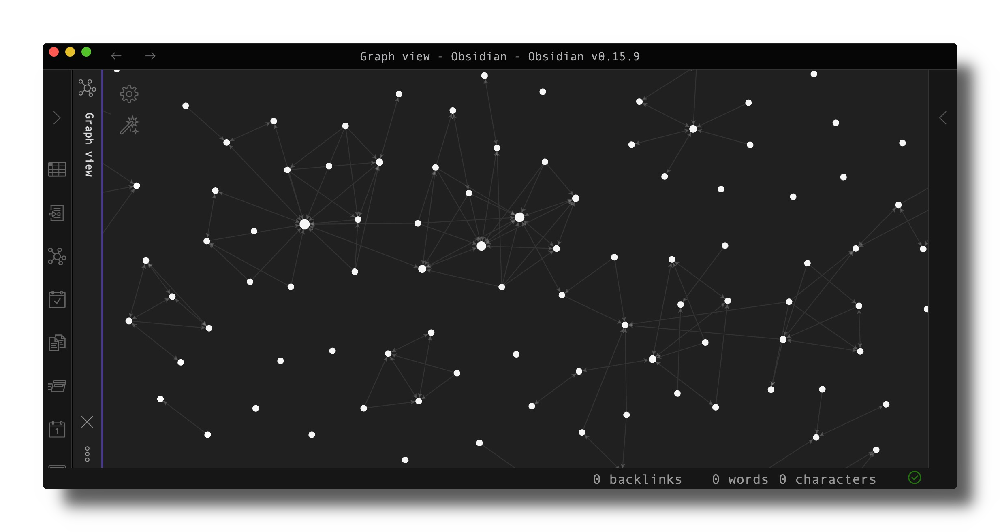
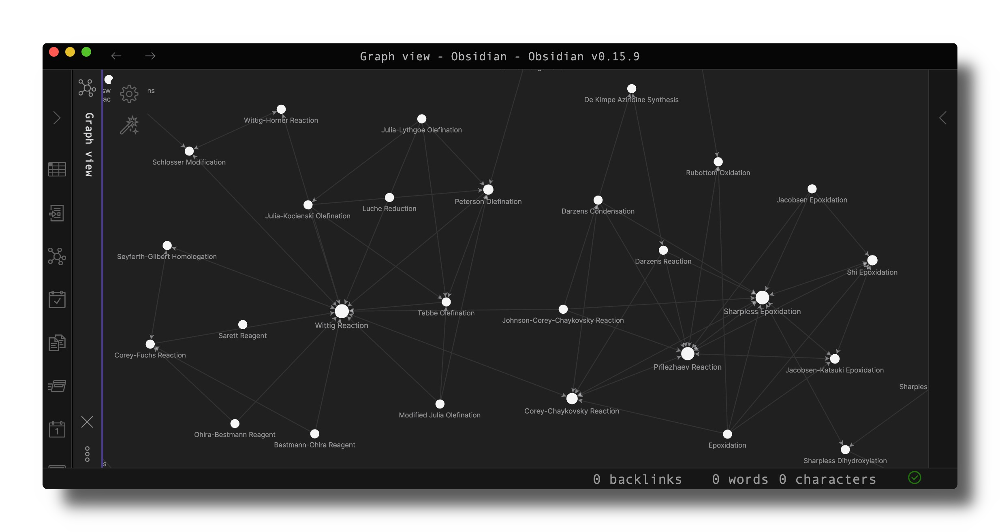

# organic-network

## Description
organic-network is a Python script that scrapes [organic-chemistry.org](https://www.organic-chemistry.org) for all of its named reactions and the reactions they are related to. This link is then iterated over to create a collection of markdown files directly in my Obsidian vault. It is then possible to visualise which reactions are related to each other and can be used as a revision resource.

## Features
- Interactive network map depicting relationship between named reactions from [organic-chemistry.org](https://www.organic-chemistry.org)
- Each node contains information about the reaction and links to its Anki cards

## Notes
So far this has primarily been a scraping project. Scraping bot uses `requests` and `beautifulsoup4` as no active JavaScript present.